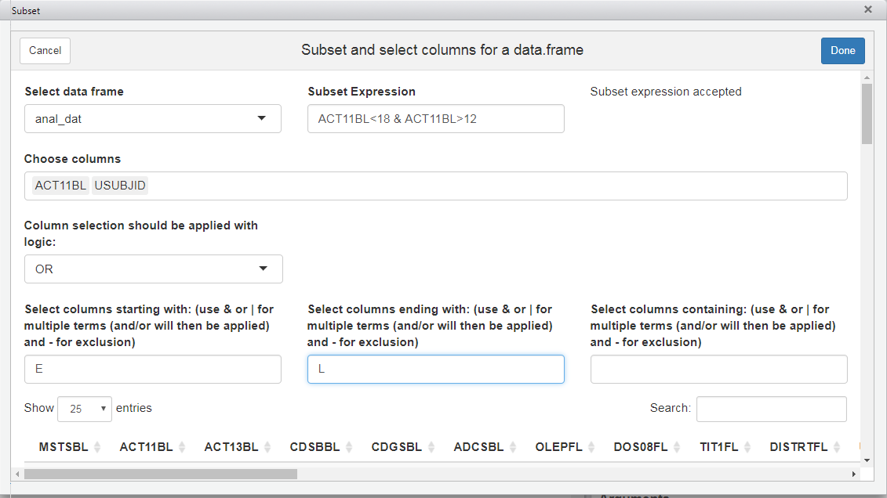
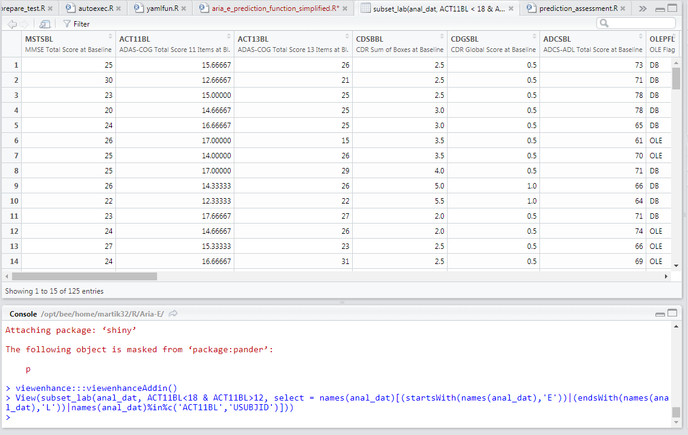

# viewenhance

## Introduction 
This package produces an add in for r studio to help browse data.

I like R studios data view, it looks nice and allows infinite scroll. However, it has some limitations. You can filter, but in a somewhat restricted fashion, and you cannot hide columns or select particular ones.

This package is intended to enchance the view. Installing it and calling the library gives you an add on in R Studio. When you click on it, it opens a shiny browser of the data. There you can apply where conditions, and select columns. When you're finished, click done and R Studio will automatically open a View() of the data that you selected. As an added bonus, this will appear in your console, so will be available if you want to save the querys that you used.

This intended to be a quick look at your data rather than an in depth analysis tool, and is designed on that basis.

Please note that this is a work in progress, so any bugs spotted please let me know!

## Using the tool

To enable this tool, you will need to install the library. You can do this using devtools. Install this package if you haven't already, then use

library(devtools)

install_github("martik32/viewenhance", host = "github.roche.com/api/v3")

library(viewenhance)

This will add an "add in" to the add in menu called "Enchanced View". You can either select this or run viewenhance:::viewenhanceAddin() in your console.

Note that this function will error if there are no data frames/matrices in your global environment. If you have at least one object, this will then load the following screen.

Here you can subset using R logic, manually select columns (if you want to remove one, click on it and press delete) and filter based on search terms. 

Note that for the search terms you can enter multiple, so if you want columns starting with A or B you can use A|B in that field, or if you want columns that don't begin with _ or A you can use -_|-A.

The different restrictions on the column selection (individually selecting columns, selecting columns that begin with a letter etc) with either be applied with AND/OR logic depending on your selection.

So for instance, selecting column PT and specifying that the name should begin with A, will, with AND selected, display no columns (as PT does not begin with A). With OR, it will display the column PT and any column beginning with A. See screenshot below for a demonstration of what a query might look like:

When finished, click done and this will open your subseted and column selected data set in the R Studio data viewer. You'll also see the logic used to create that view in your console, if you wish to use that particular command again

## Contact

If you have any suggestions/ find any bugs, please do raise an issue, or contact me directly at kieran.martin@roche.com
